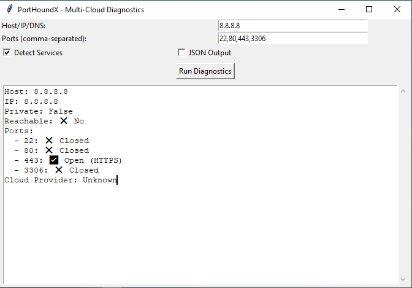
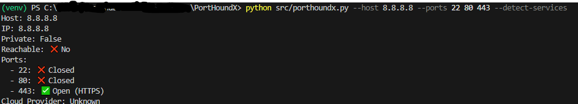

# 🐺 PortHoundX  

PortHoundX is an **extended network diagnostic and troubleshooting tool** designed for engineers, DevOps, and security enthusiasts.  
It goes beyond simple port scanning by providing **reasoned insights** about connectivity, service detection, and cloud environment identification.  

Built as a **CLI + GUI hybrid**, it’s flexible enough to run in terminals for automation or as a desktop app for interactive use.  

---

## 🚀 Why PortHoundX? (The Cause)  

Traditional port scanners only tell you if a port is open or closed. But as engineers, we often ask:  

- *Why is this port unreachable?*  
- *Is the host inside a private or public network?*  
- *Which cloud provider is running this IP?*  
- *Is this an SSH issue, a firewall issue, or DNS misconfiguration?*  

**PortHoundX was built to answer these questions** by combining basic scanning with **reasoning-based troubleshooting**.  

---

## ✨ Features  

- 🔹 **Dual Interface**: Run as **CLI** or launch the **Tkinter GUI**.  
- 🔹 **Multi-Port Support**: Check multiple ports in one run.  
- 🔹 **Service Detection**: Identify services like HTTP, HTTPS, MySQL, MongoDB, Kafka, etc.  
- 🔹 **Cloud Awareness**: Detect whether a host belongs to **AWS, GCP, Azure, IBM Cloud**.  
- 🔹 **Reasoned Output**: Not just *open/closed*, but *possible causes* (e.g., firewall, service not running).  
- 🔹 **Output Modes**: Pretty colored console output **or JSON export**.  

---

## ⚙️ Installation  

```bash
git clone https://github.com/<your-username>/PortHoundX.git
cd PortHoundX
pip install -r requirements.txt
```

---

## 🖥️ Usage  

### CLI Mode  

```bash
python src/porthoundx.py --host 8.8.8.8 --ports 22 80 443 3306
```

With **JSON output**:  
```bash
python src/porthoundx.py --host google.com --ports 22 53 443 --json
```

With **service detection**:  
```bash
python src/porthoundx.py --host 127.0.0.1 --ports 22 80 3306 --detect-services
```

---

### GUI Mode  

```bash
python src/porthoundx.py --gui
```

1. Enter **Host / DNS name**.  
2. Select **ports to scan**.  
3. Enable **service detection** and **JSON export** (optional).  
4. Click **Run Diagnostics**.  

### GUI Mode Screenshot


---

## 📊 Example Outputs  

**Pretty CLI Mode**  
```
Host: google.com
IP: 142.250.72.14
Private: False
Reachable: ✅ Yes
Ports:
  - 22: ❌ Closed
  - 80: ✅ Open (HTTP Detected)
  - 443: ✅ Open (HTTPS Detected)
Cloud Provider: GCP
```

**JSON Mode**  
```json
{
  "host": "google.com",
  "ip": "142.250.72.14",
  "is_private": false,
  "reachable": true,
  "ports": {
    "22": false,
    "80": true,
    "443": true
  },
  "cloud_provider": "GCP"
}
```
### CLI Mode Screenshot



---

## 🔮 Future Scope  

Planned enhancements for PortHoundX:  

- 🔧 **Deeper Troubleshooting Reasoning** (e.g., firewall misconfig, DNS vs. service issues).  
- 🌐 **Expanded Service Library** (Kafka, Redis, RabbitMQ, ElasticSearch, etc.).  
- ☁️ **Extended Cloud Fingerprinting** with region hints.  
- 📡 **Traceroute & Latency Insights**.  
- 🔐 **Security Mode**: detect weak TLS/SSL configurations.  

---

## ❤️ Contributing  

Contributions, ideas, and pull requests are welcome!  
If you’d like to suggest troubleshooting scenarios or add more services, open an **Issue**.  

---

🔥 **PortHoundX isn’t just a port scanner — it’s your network reasoning assistant.**
